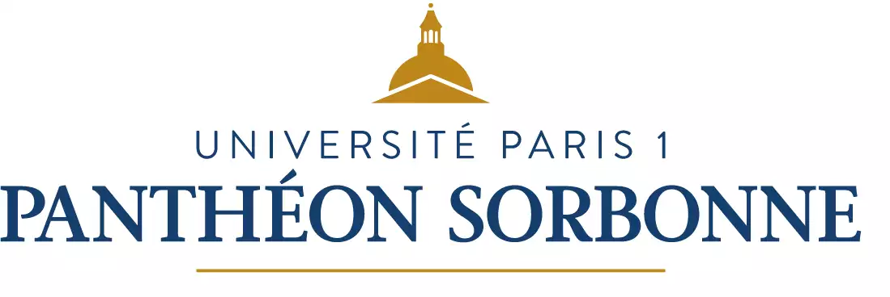

I'm an Associate Professor in [Paris 1 Panthéon-Sorbonne](https://pantheonsorbonne.fr), in the [CRI lab](https://cri.pantheonsorbonne.fr/).

## Where I come from

Before, was a PostDoc in Distributed Systems in the ERODS team of CNRS/LIG lab in Grenoble in France. I received my [PhD](https://tel.archives-ouvertes.fr/tel-01668553) in Computer Science from [Bordeaux University](https://www.u-bordeaux.fr/) in November 2017, where I was a graduate teaching assistant at [ENSEIRB-MATMECA Bordeaux INP](https://enseirb-matmeca.bordeaux-inp.fr/fr). I was a visiting student at the University College of Dublin, Ireland, in the [Performance Engineering Lab](https://pel.ucd.ie/index.php/Main_Page).

I worked as a R&D Engineer, Team and Project manager for 10 years in the software industry, owning a M.Eng (Math) form [INSA Rouen](https://www.insa-rouen.fr/), France and a M.Econ from [Aix-Marseille School of Economics](https://www.amse-aixmarseille.fr/en).

## Current Activities

My research interests are Network Softwarization (SDN, NFV),  Blockchain, Intent-based Networking, Content delivery and Techno-Economics.

I'm always looking for opportunities to contribute to a project, volunteer for a good cause or collaborate to a scientific article. Feel free to contact me: nicolas.herbaut ([at}) univ-paris1.fr

Continue to my [Research](/research) or my [Publications](/publications)

## Current Affiliations

