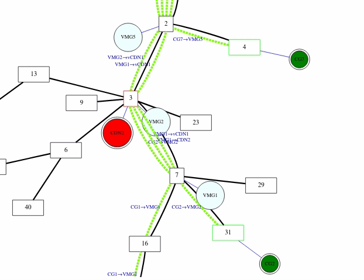

I Implemented and deployed several of Virtual Network Functions during the FP7 EU T-NOVA Project.

During this project, I got my hands dirty with OpenStack, OpenDayLight and the TeNOR Orchestrator, and cloud platform EC2, GAE.

I got familiar with the current standards of ETSI NVF, IETF Service Function Chaining and other supporting technologies such as ONOS, Ryu SDN controllers.

## Presentations

<iframe src="https://mediatheque.univ-paris1.fr/video/2819-nicolas-herbaut-sdn-intent-based-conformance-checking-application-to-security-policies/?is_iframe=true" width="100%"  style="padding: 0; margin: 0; border:0" allowfullscreen ></iframe>

## Projects

### G.I.R.A.F.E. Graphical Interface for Representing Automatic Function Embedding

#### Links 

* [Online](https://newgirafe.nextnet.top/)
* [Code](github.com/nherbaut/girafe_web)
* 
#### Description

This tool is targeted to Internet Service Providers (ISPs) that are willing to deploy a third-party virtual CDN service targetting OTT-VOD delivery market. The algorithm we implemented deploys a service function chain composed of 2 Virtual Network Functions (VNFs): the Virtual Media Gateway (VMG - for routing) and the Virtual CDN Cache (VCDN - for content delivery), that guarantee the Quality of Service for end-users on enhanced paths.

After loading a topology, we can configure the User pools that will consume the video content, as well as the legacy CDN network peering points, accessible through best-effort IP traffic. Other Service Level Agreement (SLA) parameters can be configured.

Finally, we can compute either (1) the optimal embedding of both VNFs (searching for the optimal number of VMG and VCDN to deploy and to embed) or (2) manually set the VNF numbers to embed. The results related to the placement of the embedded VNFs appear on the left diagram within the topology. The results related to the cost estimation appear on the table on the right. Additional modifications on the performed embedding can be done related to the total number of concurrent users. We also display the videos perceived by the users, depending on their types.

## Associated Publications:

1. [Nicolas Herbaut, Camilo Correa, Jacques Robin, Raul Mazo, "SDN Intent-based conformance checking: application to security policies." In the proceedings of 7th IEEE International Conference on Network Softwarization (IEEE NetSoft 2021), 2021.](https://hal.archives-ouvertes.fr/hal-03207525)
2. [Boubakr Nour, Adlen Ksentini, Nicolas Herbaut, Pantelis Frangoudis, Hassine Moungla, "A blockchain-based network slice broker for 5G services." IEEE Networking Letters, 2019.](https://doi.org/10.1109/LNET.2019.2915117)
3. [Nicolas Herbaut, Daniel Négru, Georgios Xilouris, Yiping Chen. Migrating to a NFV-based Home Gateway: Introducing a Surrogate vNF approach. Network of the Future (NOF), Sep 2015, Montréal, Canada. ⟨10.1109/NOF.2015.7333284⟩.](https://hal.archives-ouvertes.fr/hal-01485719)
4. [Nicolas Herbaut, Daniel Negru. A Model for Collaborative Blockchain-Based Video Delivery Relying on Advanced Network Services Chains. IEEE Communications Magazine, Institute of Electrical and Electronics Engineers, 2017, 55 (9), pp.70 - 76. ⟨10.1109/MCOM.2017.1700117⟩.](https://hal.archives-ouvertes.fr/hal-01610670)
5. [Nicolas Herbaut, Daniel Negru, David Dietrich, Panagiotis Papadimitriou. Service Chain Modeling and Embedding for NFV-based Content Delivery. IEEE International Conference on Communications (ICC), May 2017, Paris, France. ⟨10.1109/ICC.2017.7997165⟩.](https://hal.archives-ouvertes.fr/hal-01493381)
6. [Nicolas Herbaut, Camilo Correa, Jacques Robin, Raul Mazo. SDN Intent-based conformance checking: application to security policies. 7th IEEE International Conference on Network Softwarization (IEEE NetSoft 2021), Jun 2021, Tokyo (virtual), Japan.](https://hal.archives-ouvertes.fr/hal-03207525)
7. [Nicolas Herbaut, Daniel Negru, David Dietrich, Panagiotis Papadimitriou. Dynamic Deployment and Optimization of Virtual Content Delivery Networks. IEEE MultiMedia, Institute of Electrical and Electronics Engineers, 2017, 24 (33), pp.1 - 1. ⟨10.1109/MMUL.2017.265091653⟩.](https://hal.archives-ouvertes.fr/hal-01560112)
