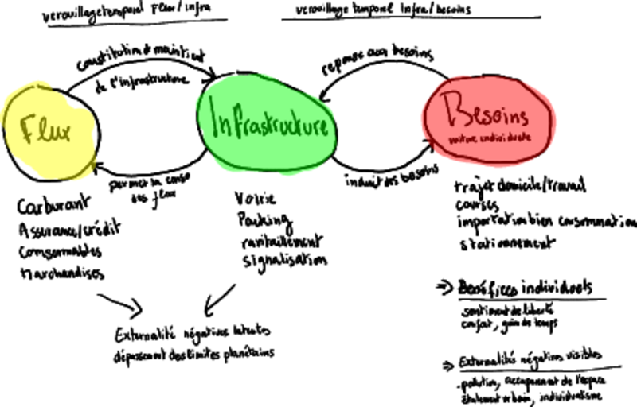
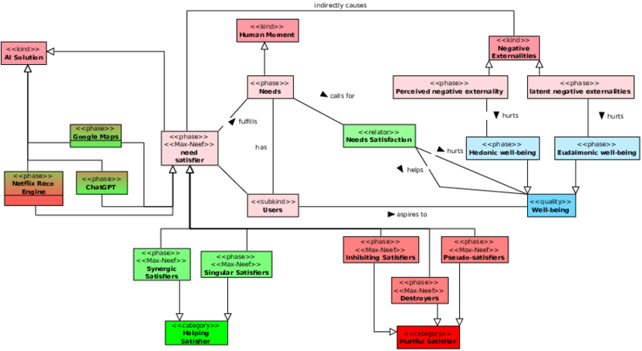

Presentation of the ideas I am developing in my research project on the study of the
sustainability (or unsustainability) of ubiquitous artificial intelligence.

*It proposes a model inspired by the scientific literature of the “Social Ecology” community, suggesting a study model based on the life of a biological organism and combining it with socio-economic aspects.* *In the proposed model, I consider the socio-technical aspects of AI in the form of three interacting blocks: flows, infrastructures, and needs. I intend to detail this model using tools commonly employed by the Information Systems community as well as other approaches, in a spirit of multidisciplinary openness.* *The expected contributions are a modeling of the metabolism of ubiquitous AI in contemporary society, the study of its limits through the prism of a finite planet, and possible pathways for shifting from the dominant model to a sustainable one, if such a model can exist.* *This work builds on my previous research conducted at the CRI on the principles and techniques of decentralization and self-sovereignty made possible by blockchain[^2], as well as my current research axes dealing with trust in information systems[^3] and experiments on lightweight embedded AI as a substitute for centralized models. The aim here is to provide tools for a critical reflection on AI, its promises and its limits, by combining contributions from digital sciences with those from systemic and socio-ecological approaches.*
# Motivations for Social Metabolism and Application to AI

The chosen approach builds on a vast body of research from *social metabolism*, defined as *“Social metabolism encompasses the biophysical flows exchanged between societies and their natural environment, as well as the flows within and between social systems.”* \[[Haberl et al. 2019](#ref-haberl2019contributions)\].  
This scientific approach draws inspiration from the communities of *Urban Metabolism*, *Ecological Economics*, *Energy and Material Flow Analysis*, as well as methods such as *Life-Cycle Assessment* and *Integrated Assessment Models*.  
It relies on the triptych (*nexus*) *stock-flow-services*[^4], originally representing the stock of matter, material flows, and the societal services enabled by them.

One of the major contributions of social metabolism is the identification of several systemic phenomena:  
- **lock-in** phenomena (*lock-in* or *legacies*) between these three components,  
- **leakage**, when the adoption of a new artifact leads to an increase in the consumption of another,  
- and the **rebound effect**, when the adoption of a supposedly more efficient service actually increases its environmental footprint due to the growth of its use.

I chose to apply this conceptual framework to the analysis of AI for three reasons:

1. On the one hand, the rise of this technology tends to make its use pervasive in society, to the extent that many new “opportunities” for AI applications are emerging across all industrial sectors and in most households (at least in the Global North), with a risk of increasing technological dependency.  
2. On the other hand, its technological foundations present a very significant **environmental footprint**[^5].  
3. Finally, the large-scale deployment of the *data centers* required for AI infrastructure has a strong territorial impact and raises numerous issues of competition for resources \[[Lopez and Diguet 2023](#ref-lopez2023sous)\].  

Although much research considers AI to be beneficial in certain areas — notably for reducing GHG emissions \[[SaberiKamarposhti et al. 2024](#ref-saberikamarposhti2024cultivating)\] \[[Adegbite et al. 2024](#ref-adegbite2024artificial)\] — studies addressing the systemic effects of AI remain rare and limited to (albeit important) considerations of AI ethics \[[Stahl et al. 2023](#ref-stahl2023systematic)\].  

I aim to better understand the **systemic impacts of AI deployment**, to study the **sustainability of the ubiquitous AI model**, and to propose **pathways for shifting toward sustainable alternatives**.
In this document, I begin by providing an illustrative example of a simplistic metabolic study focusing on a transport infrastructure (Section ). The objective of this example is to guide the reader in understanding the FIB model (Section ). I then proceed by explaining how the applied model can allow us to reason about the stability of a system (Section ) while taking into account its characteristics and first-, second-, and third-order effects. I continue by applying the model to the study of the metabolism of AI (Sections , , ) and justify the novelty of this approach. Finally, I propose directions for my future research within this theoretical framework (Section ).

# Illustrative Example of a Socio-Metabolic Study

I begin this presentation by describing a simplistic metabolic model, purely for illustrative purposes, concerning the evolution of public transport in the city of Bordeaux during the 20th century.

## Context

In 1900, the mayor of Bordeaux, Mr. Cousteau, inaugurated the first electric tram in Bordeaux, replacing the old horse-drawn models. At its peak in 1946, the network reached 253 km, 40 lines, and a total of 160,000,000 passengers per year (equivalent to 400 passengers per inhabitant per year). Mr. Chaban-Delmas, mayor from 1947 to 1995, decided as early as 1948 to completely dismantle the tram network and replace it with a fleet of buses. One of the reasons for this choice was the constraint posed by the dedicated tram tracks on individual automobile traffic. In 1997, facing road congestion in the city and the failure of the metro project, Mr. Juppé, the newly elected mayor, together with the Bordeaux urban community, decided to relaunch a tram project. Construction lasted 3 years for the initial delivery, and by 2023 the network reached 68,000,000 passengers per year (equivalent to 83 passengers per inhabitant per year)[^6].

It should be noted that the example of Bordeaux is not an isolated phenomenon, but one of many cases \[[Turnheim 2023](#ref-turnheim2023historical)\].

## FIB Model Applied to the Dismantling of the Tram in Bordeaux

The figure shows the interaction between the 3 components of our model: flows, infrastructures, and needs.

- **Flows**[^7] are the material or immaterial components that enter and exit our system with a short lifespan (arbitrarily taken as < 1 year) and are measured over a given period.  
- **Infrastructures**[^8] are the material or immaterial components with a longer lifespan, which remain in the system for a certain time.  
- **Needs**[^9] are what drive individuals to act within our system, through the means provided to them by the infrastructure in the form of *need satisfiers* according to \[[Max-Neef et al. 1991](#ref-max1991human)\].
In **first order**, flows are used to build infrastructures, and infrastructures are created to meet needs.

There are also other relationships between the components of the model, of **second order**: infrastructure is not neutral with respect to either flows or needs. The deployment of infrastructure calls for an increase in the flow[^10] necessary to maintain it. The increase in available infrastructure also calls for the provision of new means to satisfy needs[^11].

Other **third-order** effects also appear. Individual benefits are tempered by negative externalities. In our example: not only does the increase in the need for individual car travel raise pollutant emissions, but it also reconfigures urban space by enabling the development of suburbanization as well as large-scale commercial areas on the outskirts, accessible mainly by car. It should be noted that the increase in the quantity of infrastructure and flows encounters the transgression of planetary boundaries, making the system ultimately unsustainable.

The difficulty of the situation lies in the lock-in between, on the one hand, flows and infrastructures and, on the other, between infrastructures and needs:

- The construction of infrastructure is capital-intensive and requires the amortization of investments over the long term. In this context, it is difficult to reverse infrastructure development decisions, and the tendency is to wait for full amortization before proceeding with dismantling[^12].  
- Moreover, the gradual adaptation of the means of fulfilling needs through infrastructures creates a form of dependency. This dependency makes it more difficult to accept any profound modification of these infrastructures[^13].
Lock-in contributes to the stability of the system, creating forces that make a paradigm shift (reform of flows, infrastructure, and needs) difficult. This stability can be perceived as harmful when confronted with third-order negative effects (negative externalities, transgression of planetary boundaries)[^14].

It may be tempting to ask whether a systemic reading of urban metabolism could have anticipated the long-term effects linked to the dismantling of certain infrastructures. However, such a hypothesis must be handled with caution. Urban planning choices — such as those that led to the removal and later reconstruction of the Bordeaux tramway — are not solely the result of functional optimization logics. They are also the product of specific historical contexts, political power relations, sectoral economic interests, and dominant representations of progress at a given time[^15]. The current saturation of transport systems can therefore only be understood through this complexity, in which flows are but one element of the system.

# Formalization of the FIB Model 

To describe the FIB model precisely, I adopted an approach based on the work of Guizzardi \[[Guizzardi 2005](#ref-guizzardi2005ontological)\], relying in particular on the foundational ontology UFO (Unified Foundational Ontology). This ontological framework provides a rigorous modeling of entities, their relationships, and the ontological dependencies between them. It allows for an explicit representation, through a class diagram[^16], of the structural and dynamic concepts underlying the FIB model, while ensuring the semantic coherence of the whole.

The three main components of the system (*Flows*, *Infrastructure*, and *Needs*) are represented. There are two types of relationships between these components: first-order relationships (Infrastructure Building and Primary Infrastructure User) and second-order relationships (Infrastructure Maintenance and Induced Infrastructure Use). *Flows* have been divided in two to indicate their respective contribution to *first-* and *second-order* relationships. Similarly, Induced Needs, which are the co-products of the primary use of infrastructure, are the consequence of the first-order relationship between Needs and Infrastructure, and the cause of the second-order relationship between these two components.

Since needs are not acting entities, I introduce the entity *Users*, representing the infrastructure user. In this model, the *User* aspires to well-being, which can take two distinct forms: hedonic well-being[^17] and eudaimonic well-being[^18] \[[Lamb and Steinberger 2017](#ref-lamb2017human)\]. I choose to consider that the needs driving the creation of infrastructures are led by the pursuit of hedonic well-being.

*Flows* and *Infrastructures* are agents exerting a direct systemic impact, unlike the user, who exerts an indirect impact through the use of infrastructure. These impacts produce *third-order* effects in the form of externalities. Externalities may be perceived, when the causal relationship between the impacting entity and the effect is directly perceptible by the user, or latent otherwise[^19].
Perceived negative externalities impact hedonic well-being, in the sense that they directly affect it. Latent externalities, on the other hand, negatively affect well-being through its eudaimonic component[^20].

Within the application of this model using a complex systems approach, it is already relevant to identify the feedback loops that contribute to system stability:

1. The *Flows*–*Infrastructure* loop is self-sustaining due to the necessity of maintaining existing Infrastructure.  
2. The *Infrastructure*–*Needs* loop is also self-sustaining, but modulated by the reduction of needs linked to perceived negative externalities.  
3. Latent negative externalities intervene only through their impact on eudaimonic well-being. They therefore do not exert a direct moderating effect on needs. A drastic reduction in eudaimonic well-being could lead to a degradation of overall well-being, which may be compensated for by intensifying the pursuit of individual benefits. Conversely, the hedonic motivations underlying needs may be weakened in the absence of an explicit quest for hedonic well-being.  
4. Finally, latent negative externalities are a limiting factor for impacting entities. In other words, these may be constrained if they exceed a certain threshold of sustainability.

The intuitive analysis of this system allows us to identify 3 stable states resulting from 3 scenarios[^21]:

1. **degrowth scenario**: suppression of the pursuit of hedonic well-being, which has the first-order effect of limiting infrastructures and, as a second-order effect, limiting flows.  
2. **collapse scenario**: the collapse of infrastructures and flows due to the overshooting of thresholds for latent negative externalities. This situation leads to a forced limitation of needs, as these can no longer be satisfied in the absence of infrastructure.  
3. **controlled landing, awareness and limitation scenario**: a limitation of flows and Infrastructure, reaching a level of latent negative externalities that does not sufficiently impact the pursuit of eudaimonic well-being to trigger a natural limitation of the pursuit of hedonic well-being, which would in turn limit needs. The existence of a stable state in this last scenario is not guaranteed, as it depends on physical laws, the initial state of the system, and the ability of stakeholders to become aware of and accept usage limitations reflecting the physical reality of resource constraints.

After detailing the model, I now propose to present my project of applying it to the metabolism of AI.

# Application of the FIB Model to the Study of AI Metabolism

We will now analyze the metabolism of AI using the FIB model presented previously. Our objective is threefold:

First, I specialize the FIB model presented in the Figure by integrating elements specific to AI. It should be noted that the proposed elements represent an initial naïve approach, and the development of these models will need to be refined in future work. Then, I analyze the emerging dynamics specific to AI within the specialized model, in order to better understand its stability properties. Finally, I propose ideas for short- and medium-term scientific contributions aimed at enriching the model and suggesting solutions.

## Les Flux 

Dans ce document, nous simplifions le problème en ne considérant que les
flux entrants, en ignorant les exutoires[^22] ainsi que les flux de
transport des matières. D’autres flux entrants sont également ignorés
pour nous concentrer sur deux grandes catégories: les flux matériels et
les flux informationnels.

Les flux matériels proviennent des opérations de construction et de
maintenance du matériel informatique nécessaire à l’exécution des tâches
du cycle de vie de l’IA[^23]. Dans le cas d’une IA centralisée (e.g.,
ChatGPT) et/ou mutualisée (e.g., Amazon Bedrock, AWS), la majeure partie
des flux de construction d’infrastructure se concentrent dans les
centres de données. De nombreux flux de matériaux sont nécessaires,
comme les minerais métalliques ou les terres rares. Ces ressources sont
non renouvelables à l’échelle de temps humaine, ce qui conduit à une
raréfaction progressive. Selon le type de ressource et sa concentration
dans l’environnement, cette raréfaction peut engendrer des effets
négatifs différés : toute extraction non renouvelable se fait au
détriment des besoins futurs. À titre d’exemple, aujourd’hui, le
consommateur ne perçoit pas directement l’impact à long terme de la
diminution du stock de cuivre. Selon l’élasticité des prix de la matière
première, il pourra en percevoir l’externalité négative par une hausse
des prix, sans que cela soit systématique.

D’autres flux sont potentiellement renouvelables. Les flux d’électricité
ou de refroidissement peuvent l’être au premier ordre sous certaines
conditions imposées à l’infrastructure de production, par exemple via
l’usage d’hydroélectricité ou d’énergie éolienne[^24]. Cette hypothèse ne
tient toutefois plus au second ordre : les moyens de production de ces
flux dépendent eux-mêmes d’infrastructures construites avec des flux non
ou partiellement renouvelables[^25]. Même en ignorant les effets de
second ordre, un phénomène de compétition d’usage se manifeste :
l’installation de centres de données limite l’accès à l’électricité pour
les infrastructures voisines \[[Lopez and Diguet
2023](#ref-lopez2023sous)\], entrainant donc des externalités négatives.

Les flux de données sont essentiels à toutes les étapes du cycle de vie
de l’IA : lors de la création des modèles, de leur utilisation, et pour
leur maintenance en cas de *model drift*[^26], afin de préserver leur
performance par réentraînement.

The data used can be public or private. Public data flows do not present particular negative effects at the first order. However, the performance targeted by models encounters two limits:

1. personalized data are the most useful to users, but require the use of private data;  
2. an increase in public data flows may be necessary to improve model performance.  

In either case, the use of private data proves necessary. The user must provide personal data if they wish for better model performance (e.g., in the case of personal assistants or recommendation engines). They may even be compelled to do so by public authorities[^27] or incentivized by private actors in exchange for access to their services[^28]. Legislators nevertheless plan to strengthen user awareness regarding the use of their data, particularly through texts governing personal data protection (e.g., GDPR), which require obtaining their consent before any collection. This last observation allows us to classify the use of private data as a negative externality.
## Infrastructures

The infrastructures mobilized by AI largely inherit from those already implemented for other uses:

1. **Human resources**: these include individuals trained in the use of AI tools, as well as professionals specialized in their design and maintenance. The case of users is particular, as many AI solutions rely on reinforcement learning from human feedback (RLHF), where the very use of tools enables the expression of preferences regarding the outputs produced. This feedback is used to improve the models. It creates a dynamic of increasing returns to scale: the more the systems are used, the more effective they become for all users. Other human resources are dedicated to improving solutions: *data workers*[^29] contribute to the creation and quality of datasets, while AI engineers work on model optimization. The latter are highly qualified, requiring several years of academic training, which impacts their availability in the labor market and drives the creation of specialized training programs.

2. **Informational infrastructure**: this mainly includes the datasets used for training, the models used for inference, and a potential learning component. Other software components are close to those of traditional information systems and are ignored in a first approximation. All these elements rely on physical resources. While datasets can be stored with standardized big data technologies, learning components and models require specific hardware resources (GPU, TPU, NPU, fast memory), which are often not easily reusable outside the AI context.

3. **Physical infrastructures**: these include data centers, which today perform most large-scale training operations, the energy infrastructures required for their operation, and the devices enabling interaction with AI (mediation layer). The *data entry points* layer includes physical devices used to capture data to feed datasets. These may be consumer devices (personal devices) such as PCs or smartphones, or dedicated devices such as IoT sensors or medical equipment. *Interface devices* refer to the devices through which users interact with AI systems. They include both conventional devices (PCs, smartphones) and specialized devices with local inference or learning capabilities, such as virtual reality headsets or edge devices. Part of the AI lifecycle can thus be offloaded to the network edge to improve performance in terms of latency. The number of devices integrating AI capabilities is constantly increasing, with interfaces becoming more and more specialized for certain uses.

4. **Regulation**: AI is governed by specific regulations[^30] covering the entire lifecycle of systems, as well as more general regulations (privacy regulation, environmental regulation) impacting some of its components.  
   - Privacy regulations govern the use of personal data[^31].  
   - Environmental regulations impose constraints on the ecological footprint of physical infrastructures. This includes, for example, rules on soil artificialization by data centers (e.g., “zero net land take”), or rules limiting CO2 emissions[^32].  
   - Some of these rules are legally binding (binding regulations), while others fall under non-binding guiding principles.

The infrastructural subsystem of AI can be seen, in a first approximation, as a self-regulating system: some components consume resources (physical infrastructure), while others are designed to regulate this consumption and ensure compliance with the values of the host society (regulatory infrastructure)[^33]. The system is also self-improving, in the sense that users contribute to the continuous improvement of models. With constant demand, it can thus become increasingly efficient.

However, as we have seen, the dynamics of infrastructure depend on human needs while also generating new ones. Its stability must therefore be analyzed systemically: second-order effects contribute to the continuous growth of infrastructural needs driven by system improvements. Furthermore, since *models* are subject to *model drift*, they must be maintained through the continuous addition of new data to *datasets*. A large part of the literature focuses on improving the environmental performance of AI, which is undoubtedly a progress for the field \[[Verdecchia et al. 2023](#ref-verdecchia2023systematic)\]. Nevertheless, these considerations are no longer sufficient when studying metabolism to address challenges from a systemic perspective. Other researchers go further by considering both direct \[[Morand et al. 2024](#ref-morand2024mlca)\] and indirect \[[Wilson et al. 2024](#ref-wilson2024evidence)\] impacts of infrastructures, producing results that are highly context-dependent and illustrate (1) the difficulty of identifying these phenomena and (2) the inherent methodological challenges.

## Needs

Human beings have needs, in the sense of \[[Max-Neef et al. 1991](#ref-max1991human)\]. These needs are met through *Need Satisfiers*, which can be grouped into two broad categories: Helping Satisfiers and Hurtful Satisfiers.

Several types of Satisfiers can be distinguished:

- **Synergic Satisfiers**: they effectively meet the targeted need while simultaneously contributing to the satisfaction of other needs.  
- **Singular Satisfiers**: they meet a specific need without significantly influencing others.  
- **Inhibiting Satisfiers**: they meet a need but hinder the satisfaction of other needs.  
- **Destroyers**: they claim to meet a need but actually prevent its satisfaction, as well as the satisfaction of other needs.  
- **Pseudo-Satisfiers**: they provide apparent short-term satisfaction but compromise the satisfaction of the need in the medium or long term. These are a particular form of Destroyers, whose negative effects are poorly perceived at the time of their implementation.  

These *Satisfiers* can generate negative externalities that affect well-being while paradoxically constituting the very conditions of possibility for that well-being. Certain uses of AI can be easily classified. For example, the generation of *deepfakes* for deceptive purposes or cyberattacks targeting healthcare systems clearly fall under *Destroyers*. It is noteworthy that the *Human Moment* (the intention) is crucial in this classification, as it distinguishes intentionally malicious uses. Other uses of AI are not controversial: the AlphaFold solution, which enables the prediction of protein structures, or the use of AI for early detection of pathologies, represents major scientific advances in biology. Similarly, automated analysis of seismic data for earthquake forecasting directly contributes to population safety. Finally, some uses are more ambivalent. The use of ChatGPT by students can help them rephrase concepts covered in class, but it also facilitates cheating in project submissions, which compromises the acquisition of skills targeted by a degree. Netflix’s recommendation system offers personalized content but may also reduce cultural diversity in media consumption[^34]. *Helping Satisfiers* contribute to eudaimonic well-being, while *Hurtful Satisfiers* may temporarily enhance hedonic well-being. However, each of these *Satisfiers* is likely to generate latent negative externalities and is not intrinsically sustainable. It is also important to note that many articles refer to AI as a *possible solution* to environmental problems, although the issue should not be addressed solely from the perspective of needs \[[Schoormann et al. 2023](#ref-schoormann2023artificial)\].

The needs subsystem thus allows for an initial classification regarding the sustainability of AI solutions, relative to the intentions of users, according to a first-order analysis. However, systemic sustainability also requires considering second- and third-order effects to fully assess the advisability of deploying such solutions.

# Future Work

This section presents ongoing and upcoming work, which aims to contribute to the research field of AI metabolism studies, positioning my research within the framework of the FIB model described earlier. This framework opens the way to numerous scientific contributions, divided into four axes: first, a methodological axis to refine the model, followed by axes specifically targeting each of the FIB subsystems.
## Methodological Axis: Refinement of the FIB Model

As mentioned earlier, many factors were left aside in our initial modeling. A more complete life cycle analysis, based on existing work \[[Bouza et al. 2023](#ref-bouza2023estimate)\] and a systemic approach \[[Ekchajzer et al. 2024](#ref-ekchajzer2024decision)\], would allow for a deeper understanding of the actual sustainability of the system. The difficulty, beyond data collection, lies in accounting for second- and third-order effects (rebound effects), which represent a real challenge for both researchers and public authorities \[[Courboulay 2023](#ref-courboulay2023archipel)\].

It would also be relevant to examine the causes of the current transformation toward a society increasingly dependent on AI. The mere availability of technical capacities resulting from innovation is not sufficient to explain such a shift. This dynamic rather seems to be embedded in deeper societal transformations — economic, cultural, and political — which reshape representations of progress, efficiency, and well-being[^35].

## Needs Axis: Adoption of AI — the Double Role of Trust

Trust, understood as “the willingness of a party to be vulnerable to the actions of another party” \[[Mayer et al. 1995](#ref-mayer1995integrative)\], plays a central role in the adoption of artificial intelligence solutions.  
However, the study of trust as applied to technical systems adapts poorly to systems based on AI. While certain classical dimensions remain relevant — such as performance or transparency — the anthropomorphic characteristics of AI systems tend to blur the traditional reference points of trust analysis \[[Lankton et al. 2015](#ref-lankton2015technology)\].

From this observation, we have undertaken research on trust mechanisms in AI systems, not with the aim of promoting or strengthening user trust, but rather to identify the factors that generate it, their interactions, and the conditions under which legitimate trust emerges[^36].  
This distinction is essential in the framework of needs classification. Indeed, Max-Neef identifies *Pseudo-Satisfiers* as solutions imposed on individuals through propaganda or advertising, which ultimately prevent the authentic satisfaction of their needs. Restoring trust in AI to its proper place thus allows us to better qualify legitimate uses serving human needs, independently of the question of their material sustainability.

## Infrastructure and Flow Axis: Feasibility and Evaluation of Decentralized AI Solutions

As illustrated by the application of the FIB model, the deployment of the centralized AI model we currently know raises problems in terms of flows and infrastructures. We have also begun to study the substitutability of this model in the case of home assistants[^37]. These — just like, on a larger scale, the concept of the *smart building* — show, at first glance, energy efficiency gains and reduced maintenance costs \[[Ejidike and Mewomo 2023](#ref-ejidike2023benefits)\], though these must be balanced against the environmental impact of large-scale deployment of such solutions.

We are exploring the possibility that a disconnected, explainable, and *coachable* model could address the challenges posed by the unsustainability of flows, respect for privacy, and the limitations of current infrastructures.  
We are currently developing an *edge device* prototype[^38] to address these challenges while maintaining a high level of service and user acceptance \[[Vrain and Wilson 2024](#ref-vrain2024automation)\].

Decentralization also involves adopting solutions that enable users to reclaim control over their data, without excluding third-party uses if deemed necessary. The study of blockchain-based solutions developed in the context of self-sovereign identity \[[Preukschat and Reed 2021](#ref-preukschat2021self)\] is one path that could enable fine-grained control of these data and their use in AI systems, once again subject to a sustainability assessment.

## Limits Axis: Exceeding Planetary and Cognitive Boundaries

While IPCC reports leave no doubt about the transgression of planetary boundaries, another threat linked to the deployment of AI solutions lies in exceeding human cognitive boundaries. Indeed, performance — rather than explainability — is currently the main objective of the promoters of these technologies.  
The fear is that development may reach a point where humans are no longer able to understand or interpret the results produced by models that have become indispensable to the functioning of our societies.

It is therefore essential to study in more detail the human cognitive limits to be respected, as well as the technical means to ensure that AI systems account for them.

# Conclusion

This document establishes the conceptual and methodological foundations of my future work on the metabolism of artificial intelligence, based on a foundational approach formalized through the FIB model. By articulating flows, infrastructures, and needs, this framework makes it possible to analyze the stability and sustainability of sociotechnical systems integrating AI.

The application of this model to ubiquitous AI reveals complex dynamics, where apparent gains in performance or comfort are often accompanied by negative externalities, structural lock-ins, and systemic rebound effects. Taking into account human, regulatory, and material dimensions, as well as second- and third-order effects, appears essential to understand current trajectories and to consider sustainable alternatives.

The proposed research axes open the way to interdisciplinary contributions aimed at exploring technological and organizational alternatives — notably through decentralization, explainability, and the redefinition of legitimate uses of AI with respect to human needs. The work initiated here constitutes a first step toward a systemic understanding of the social and ecological footprint of AI, and toward the development of landing scenarios compatible with planetary and human boundaries.

# References

Adegbite, A.O., Barrie, I., Osholake, S.F.,
Alesinloye, T., and Bello, A.B. 2024. Artificial intelligence in
climate change mitigation: A review of predictive modeling and
data-driven solutions for reducing greenhouse gas emissions.

Bouza, L., Bugeau, A., and Lannelongue,
L. 2023. How to estimate carbon footprint when training deep
learning models? A guide and review. *Environmental Research
Communications* *5*, 11, 115014.

Bugeau, A. and Ligozat, A.-L. 2023. How
digital will the future be? Analysis of prospective scenarios. *arXiv
preprint arXiv:2312.15948*.

Casilli, A.A., Le Bonniec, T., and Posada,
J. 2025. *The human cost of DeepSeek*.

Courboulay, V. 2023. *L’archipel des
gafam*. Actes Sud. Open Praxis DOI.

Ejidike, C.C. and Mewomo, M.C. 2023.
Benefits of adopting smart building technologies in building
construction of developing countries: Review of literature. *SN Applied
Sciences* *5*, 2, 52.

Ekchajzer, D., Bornes, L., Combaz, J., Letondal,
C., and Vingerhoeds, R. 2024. Decision-making under environmental
complexity: The need for moving from avoided impacts of ICT solutions to
systems thinking approaches. *2024 10th international conference on ICT
for sustainability (ICT4S)*, IEEE, 29–40.

Fastowski, A. and Kasneci, G. 2024.
Understanding knowledge drift in llms through misinformation.
*International workshop on discovering drift phenomena in evolving
landscapes*, Springer, 74–85.

Guizzardi, G. 2005. Ontological
foundations for structural conceptual models.

Haberl, H., Wiedenhofer, D., Pauliuk, S.,
Krausmann, F., Müller, D.B., and Fischer-Kowalski, M. 2019.
Contributions of sociometabolic research to sustainability science.
*Nature Sustainability* *2*, 3, 173–184.

Kiddee, P., Naidu, R., and Wong, M.H.
2013. Electronic waste management approaches: An overview. *Waste
management* *33*, 5, 1237–1250.

Lamb, W.F. and Steinberger, J.K. 2017.
Human well-being and climate change mitigation. *Wiley Interdisciplinary
Reviews: Climate Change* *8*, 6, e485.

Lankton, N.K., McKnight, D.H., and Tripp,
J. 2015. Technology, humanness, and trust: Rethinking trust in
technology. *Journal of the Association for Information Systems* *16*,
10, 1.

Lopez, F. and Diguet, C. 2023. *Sous le
feu numérique spatialités et énergies des
data centers*.

Max-Neef, M.A., Elizalde, A., and Hopenhayn,
M. 1991. *Human scale development: Conception, application and
further reflections*.

Mayer, R.C., Davis, J.H., and Schoorman,
F.D. 1995. An integrative model of organizational trust. *Academy
of management review* *20*, 3, 709–734.

Meadows, D.H., Meadows, D.L., Randers, J., and
Behrens, W.W. 2018. The limits to growth. In: *Green planet
blues*. Routledge, 25–29.

Mollen, A., Keilbach, J., Brodie, P., et
al. 2024. Governing digital infrastructures for a secure and
sustainable future. *Available at SSRN 4879449*.

Morand, C., Ligozat, A.-L., and Névéol,
A. 2024. Mlca: A tool for machine learning life cycle assessment.
*2024 10th international conference on ICT for sustainability (ICT4S)*,
IEEE, 227–238.

Newman, N. 2013. The costs of lost
privacy: Consumer harm and rising economic inequality in the age of
google. *Wm. Mitchell L. Rev.* *40*, 849.

Preukschat, A. and Reed, D. 2021.
*Self-sovereign identity*. Manning Publications.

SaberiKamarposhti, M., Ng, K.-W., Yadollahi, M.,
Kamyab, H., Cheng, J., and Khorami, M. 2024. Cultivating a
sustainable future in the artificial intelligence era: A comprehensive
assessment of greenhouse gas emissions and removals in agriculture.
*Environmental Research* *250*, 118528.

Sadin, É. 2016. *La silicolonisation du
monde: L’irrésistible expansion du libéralisme numérique*. L’échappée.

Schoormann, T., Strobel, G., Möller, F., Petrik,
D., and Zschech, P. 2023. Artificial intelligence for
sustainability—a systematic review of information systems literature.
*Communications of the Association for Information Systems* *52*, 1, 8.

Stahl, B.C., Antoniou, J., Bhalla, N., et
al. 2023. A systematic review of artificial intelligence impact
assessments. *Artificial Intelligence Review* *56*, 11, 12799–12831.

Stanley, S.K., Hogg, T.L., Leviston, Z., and
Walker, I. 2021. From anger to action: Differential impacts of
eco-anxiety, eco-depression, and eco-anger on climate action and
wellbeing. *The Journal of Climate Change and Health* *1*, 100003.

Turnheim, B. 2023. The historical
dismantling of tramways as a case of destabilisation and phase-out of
established system. *Proceedings of the National Academy of Sciences*
*120*, 47, e2206227120.

Verdecchia, R., Sallou, J., and Cruz, L.
2023. A systematic review of green AI. *Wiley Interdisciplinary Reviews:
Data Mining and Knowledge Discovery* *13*, 4, e1507.

Vrain, E. and Wilson, C. 2024. Automation
acceptance for sustainable digital daily life. *2024 10th international
conference on ICT for sustainability (ICT4S)*, IEEE, 10–19.

Wilson, C., Agnew, M., Amanta, F., Van Fan, Y.,
Kumar, P., and Seger, M. 2024. Evidence synthesis of indirect
impacts of digitalisation on energy and emissions. *2024 10th
international conference on ICT for sustainability (ICT4S)*, IEEE,
116–127.

[^1]: ce concept sous-tend l’idée que la disponibilité et les performances
de l’IA peuvent devenir si grandes qu’il est susceptible d’impacter
directement de nombreuses activités humaines, au delà des utilisations
traditionnelles de l’IA.

[^2]: **Blockchain, aspects socio-téchniques**: voir thèses de Nicolas Six
(2019-2023) et Claudia Négri (2019-2023)

[^3]: **Confiance et IA** voir thèses d’Eddy Kiomba (2022-2025) et Yuntian
Ding (2024-2027)

[^4]: Dans ce document, j’emploie une terminologie légèrement différente —
**Flux-Infrastructure-Besoins (FIB)** — car elle est plus parlante pour
refléter les matérialités des concepts en jeu.

[^5]: Deloitte prévoit une augmentation de la consommation électrique liée
à l’IA de 1680 TWh à 3550 TWh par an d’ici 2050.

[^6]: https://s.nextnet.top/tram “Le tramway de Bordeaux, une histoire,”
Christophe Dabitch, Editions Sud Ouest

[^7]: le carburant des voitures, les consommables, les marchandises
transportées…

[^8]: les nouvelles infrastructures routières construites à Bordeaux pour
remplacer le tram: les voitures, la voirie, les parkings pour les
voitures, les stations-service…

[^9]: Les besoins sont les bénéfices individuels espérés par la mise en
place de l’infrastructure: une liberté supplémentaire de déplacement, un
confort amélioré et un gain de temps.

[^10]: l’augmentation du nombre de routes disponibles augmente le nombre
de voitures et d’usages de celle-ci.

[^11]: l’usage de la voiture individuelle permet un gain de temps dans les
déplacements, ce qui va inciter les habitants à aller se loger plus loin
du centre dans ces zones dont l’accès est rendu nouvellement possible
grâce à la voiture entrainant une augmentation de l’usage.

[^12]: Dans le cas du tram de bordeaux, celui-ci a été facilité par la
dégradation du réseau au sortir de la guerre, et donc une réduction
exogène de l’infrastructure.

[^13]: Pour notre exemple, le contexte d’après-guerre est la priorité
donnée à la reconstruction, ce qui a facilité l’acceptation de la
suppression du tram électrique, et son remplacement par son alternative
plus moderne du bus diesel, toujours de façon exogène.

[^14]: L’état précédent du système (période 1900-1946) n’a pu être dépassé
qu’à la lumière de deux effets exogènes: le délitement de
l’infrastructure lié aux effets de la Seconde Guerre mondiale, et la
culture automobile, érigée en symbole de progrès après la Libération et
l’intervention de l’état centralisateur au travers du commissariat à la
reconstruction.

[^15]: Plusieurs autres facteurs ont été avancés pour expliquer le manque
d’entretien du réseau historique. Parmi eux : les contraintes
esthétiques ayant conduit à l’adoption de systèmes APS peu fiables,
l’effet repoussoir exercé sur les classes bourgeoises par la facilité
d’accès des classes populaires au centre-ville, l’absence de lobbying en
faveur de la maintenance des infrastructures existantes, ou encore le
désengagement progressif de l’État \[[Turnheim
2023](#ref-turnheim2023historical)\].

[^16]: https://ontouml.org/

[^17]: **Hédonique**: Relatif au plaisir immédiat, l’approche hédonique du
bien-être évalue l’expérience d’un individu en fonction des affects
positifs et négatifs qu’il ressent, ainsi que de la satisfaction de ses
désirs ou préférences.

[^18]: **Eudémonique**: L’approche eudémonique du bien-être se concentre
sur la réalisation de soi, le sens donné à la vie, et l’actualisation du
potentiel personnel, au-delà du simple plaisir ou de la satisfaction
momentanée.

[^19]: à titre d’exemple, les bouchons sur la rocade sont une externalité
négative perçue, alors que la disparition d’une espèce d’amphibien lors
de la construction d’une autoroute est latente.

[^20]: le phénomène d’éco-anxiété serait la manifestation la plus directe
des externalités latente: les personnes touchées souffrent du manque de
perspectives dans l’avenir et sur les générations futures, sans
nécessairement en percevoir les effets immédiats \[[Stanley et al.
2021](#ref-stanley2021anger)\].

[^21]: l’approche par scénario est inspirée de \[[Meadows et al.
2018](#ref-meadows2018limits)\]. Même si les scénarios de décroissance
et d’effondrement sont rarement abordés dans la recherche en
informatique \[[Bugeau and Ligozat 2023](#ref-bugeau2023digital)\], nous
pensons qu’il est pertinent de les présenter dans notre cadre
conceptuel.

[^22]: de nombreuses études portant sur le cycle de vie des appareils
informatiques et de la gestion des e-waste ont été publiée montrant le
problème et les limites des solutions \[[Kiddee et al.
2013](#ref-kiddee2013electronic)\]

[^23]: Cycle de vie de l’IA: collecte de données, préparation, extraction
de caractéristiques, entraînement, test et inférence

[^24]: **IA et ER**: étant donné le caractère parfois intermittant des ER
et leur part dans la puissance installée, cette condition n’est pas
réalisée aujourd’hui, même si de nombreux acteurs du cloud achètent les
certificats ER correspondants et investissent dans les ER
(e.g. https://s.nextnet.top/clean\_apple).

[^25]: 60 % du poids d’une éolienne est constitué de béton, qui n’est pas
recyclable en boucle fermée, mais seulement valorisable sous forme de
granulat.

[^26]: le **model drift** découle de la disparité grandissante entre les
données utilisées pour entrainer le modèle et celle actuellement
disponible. Dans le cas des LLM, ce phénomène peut participer à la
désinformation \[[Fastowski and Kasneci
2024](#ref-fastowski2024understanding)\]

[^27]: Citons l’autorisation temporaire de la reconnaissance faciale
automatique pendant les JO de Paris 2024, dont la pérennisation au-delà
du 31/03/25 est demandée par la préfecture de police
https://s.42l.fr/JTRs\_YJd.

[^28]: Citons par exemple l’utilisation des données privées par Google en
échange du service GMail \[[Newman 2013](#ref-newman2013costs)\]

[^29]: Les “Data Annotators” chinois jouent un rôle crucial dans le succès
de DeepSeek, mais leurs conditions de substistance soulèvent des
questions éthiques \[[Casilli et al. 2025](#ref-casilli2025human)\]

[^30]: l’AI act Européen est un exemple.

[^31]: par exemple RGPD en Europe, CPRA en Californie ou PIPL en chine,
avec des périmètres différents et parfois un privilège d’accès des
pouvoirs publics (PIPL).

[^32]: le “European Green Deal” est un exemple.

[^33]: Même si la pertinence des décisions du régulateur vis-à-vis de la
soutenabilité de l’infrastructure ICT fait débat \[[Mollen et al.
2024](#ref-mollen2024governing)\]

[^34]: Voir ma participation à la Chaire de Paris 1 : *Pluralisme culturel
et éthique du numérique*, où nous avons étudié l’impact du moteur de
recommandation sur la production audiovisuelle européenne.

[^35]: Eric Sadin va jusqu’à suggérer l’instauration d’un nouveau modèle
civilisationel, décesissant l’être humain de son libre arbitre au profit
des algorithmes \[[Sadin 2016](#ref-sadin2016silicolonisation)\].

[^36]: Les récentes mises à jour de ChatGPT l’ont rendu extrêmement
anthropomorphique, ce qui crée une confusion sans précédent quant à la
confiance que le public peut lui accorder.

[^37]: Les assistants domotiques comme Alexa ou Google Home sont basés sur
une IA centralisée dans les datacenters des GAFAM. Le projet
[CUPID25](https://cupid25.miage.dev) vise à proposer une alternative et
à en évaluer la soutenabilité.

[^38]: Nous avons commencé à travailler avec la plateforme Raspberry Pi 5
et l’accélérateur d’IA Hailo-8, permettant de réduire drastiquement la
consommation énergétique liée à l’inférence.
